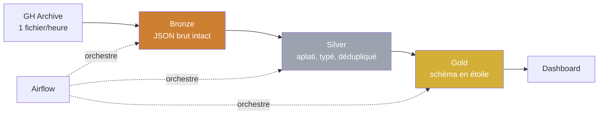

# GH Archive Lakehouse

> Pipeline ELT sur les archives publiques de GitHub — de 740 millions
> d'événements bruts à un modèle analytique interrogeable.


---

## Le constat de départ

[GH Archive](https://www.gharchive.org/) publie chaque heure l'intégralité
des événements publics de GitHub. En analysant une heure au hasard
(2026-08-01 15h UTC), trois faits ressortent :

| Observation | Mesure |
|---|---|
| Volume horaire | 168 788 événements, 104 Mo décompressés |
| Part de `PushEvent` | **95,2 %** (norme historique : 40-50 %) |
| Activité automatisée détectée par le nom du compte | **6,9 % seulement** |

Les dépôts les plus actifs de cette heure s'appellent `er-forge-probe`,
`email-probe`, `list-check` — ce ne sont pas des projets, mais des comptes
qui poussent du code en boucle. **L'activité automatisée ne se déclare pas
`[bot]`.**

D'où l'objectif de ce projet :

> **Isoler le signal humain dans un flux à 95 % automatisé**, et construire
> par-dessus un modèle analytique fiable sur l'activité open source.

Analyse complète : [`docs/01-exploration.md`](docs/01-exploration.md)

---

## Architecture



**Architecture Médaillon** — chaque couche a une responsabilité unique :

| Couche | Contenu | Règle |
|---|---|---|
| **Bronze** | Archives gzip telles que publiées | Immuable. Aucune transformation. |
| **Silver** | Une table par famille d'événements | Typé, dédupliqué, bots marqués |
| **Gold** | Faits et dimensions | Prêt pour la restitution |

---

## Décisions d'ingénierie

Chaque décision découle d'une observation mesurée, pas d'une préférence.

| # | Décision | Motivée par |
|---|---|---|
| 1 | Ingestion **idempotente** avec table de contrôle | Reprise sur échec sans doublon sur 4 380 heures |
| 2 | Écriture **atomique** (`.tmp` puis `rename`) | Un fichier visible est toujours un fichier complet |
| 3 | Bots **conservés avec un drapeau**, jamais supprimés | Toute suppression en Bronze est irréversible |
| 4 | Détection d'automatisation **comportementale** | L'heuristique par nom ne capte que 6,9 % du volume |
| 5 | **Une table par famille** d'événements en Silver | Le `payload` varie de 1 à 7 clés sans recouvrement |
| 6 | Lignes invalides mises en **quarantaine** | Ne jamais perdre de donnée en silence |
| 7 | Durée des PR par **sessionisation** | Le champ `merged_at` est absent des archives |

---

## Feuille de route

**Semaine 1 — Bronze**

- [x] Exploration et profilage des données
- [x] Mise en place du repo et du versionnement
- [ ] Ingestion idempotente avec table de contrôle
- [ ] Backfill 6 mois + Docker Compose (MinIO, PostgreSQL)

**Semaine 2 — Silver & Gold**

- [ ] Bronze → Silver avec Spark
- [ ] Apache Iceberg et partitionnement
- [ ] Modélisation dimensionnelle avec dbt
- [ ] Tests de qualité de données

**Semaine 3 — Orchestration & restitution**

- [ ] DAG Airflow
- [ ] Table `fact_pr_lifecycle` par sessionisation
- [ ] Dashboard Metabase
- [ ] CI/CD GitHub Actions et mesures de performance

---

## Démarrage rapide

### Explorer une heure de données

```bash
git clone https://github.com/khaledallouch500-lab/gharchive-lakehouse.git
cd gharchive-lakehouse
python scripts/explore.py --date 2026-08-01 --hour 15
```

Aucune dépendance externe requise — bibliothèque standard Python uniquement.
Le script produit un profilage complet : volume, répartition des types,
variabilité du schéma, détection de bots, champs manquants.

---

## Stack technique

| Domaine | Outils |
|---|---|
| Ingestion | Python 3.10+ |
| Stockage | MinIO / S3, Apache Iceberg |
| Traitement | Apache Spark |
| Transformation | dbt |
| Orchestration | Apache Airflow |
| Restitution | Metabase |
| Infrastructure | Docker Compose, Terraform |
| CI/CD | GitHub Actions |

---

## Structure du dépôt

```
gharchive-lakehouse/
├── docs/          # analyses et décisions d'architecture
├── scripts/       # outils d'exploration et utilitaires
├── src/           # code du pipeline
└── data/          # données locales (non versionné)
```

---

## Auteur

**Khaled Allouch** — Data Engineer
[LinkedIn](https://linkedin.com/in/Khaled-Allouch) ·
[GitHub](https://github.com/khaledallouch500-lab)